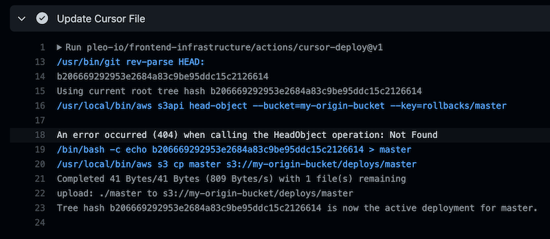

<h1 align="center">
  🔋 Pleo SPA CI/CD - Cursor Deploy Action
</h1>



<!-- action-docs-description -->

## Description

Deploy the new version of the app by modifying a cursor file in S3 bucket for the given branch.

<!-- action-docs-description -->

Performs a deployment by updating a cursor file in an S3 bucket. This relies on infrastructure that
uses the cursor files to serve the correct markup to the user.

Note that the action assumes that the AWS credentials has already been configured for the job, and
allow to read and write to the S3 bucket provided as input. Use the `configure-aws-credentials`
action in a step prior to running this action to ensure that's the case.

<!-- action-docs-inputs -->

## Inputs

| parameter            | description                                                                | required | default |
| -------------------- | -------------------------------------------------------------------------- | -------- | ------- |
| rollback_commit_hash | Commit hash to roll back to, defaults to the previous commit on the branch | `false`  |         |
| bucket_name          | Bucket to use for deployments                                              | `true`   |         |
| deploy_mode          | The deployment mode (default / rollback / unblock)                         | `false`  | default |

<!-- action-docs-inputs -->

<!-- action-docs-outputs -->

## Outputs

| parameter    | description                                                                    |
| ------------ | ------------------------------------------------------------------------------ |
| tree_hash    | The tree hash of the performed deployment                                      |
| branch_label | The branch label used for deployment (e.g. the hostname label for preview URL) |

<!-- action-docs-outputs -->

## Example Use

```yml
- name: Update the cursor file
  id: deployment
  uses: pleo-io/pleo-spa-cicd/actions/cursor-deploy@v6
  with:
      bucket_name: my-s3-bucket
```

## Rollbacks

The action supports rollbacks with blocking of automatic deployments until an explicit action is
taken to undo the rollback.

> Note that this will rollback to any commit that existed in the current branch history. It doesn't
> guarantee that the the tree hash you're rolling back to was successfully deployed before or that
> it doesn't suffer from the same issue as the reason for rollback. The developer performing the
> manual rollback is responsible for ensuring that the rollback is to a safe commit.

You can create rollback and unblock GitHub workflows triggered via repository dispatch, e.g.

```yml
name: Rollback
on:
    workflow_dispatch:
        inputs:
            sha:
                required: false
jobs:
    rollback:
        runs-on: ubuntu-22.04
        steps:
            - uses: actions/checkout@v3
              with:
                  fetch-depth: 10
            - uses: aws-actions/configure-aws-credentials@v2.0.0
              with:
                  aws-access-key-id: ${{ secrets.AWS_ACCESS_KEY_ID }}
                  aws-secret-access-key: ${{ secrets.AWS_SECRET_ACCESS_KEY }}
            - name: Update Cursor File
              uses: pleo-io/pleo-spa-cicd/actions/cursor-deploy@v6
              with:
                  bucket_name: my-origin-bucket
                  rollback_commit_hash: ${{ github.event.inputs.sha }}
                  deploy_mode: rollback
```

Note that we use `fetch-depth: 10` for the checkout action. This is required because the action
checks if the selected SHA exists on the branch history, to avoid rollbacks to arbitrary commits.
You can create a similar workflow for unblocking (here you don't need `fetch-depth: 10`)

```yml
name: Unblock
on: workflow_dispatch
jobs:
    rollback:
        runs-on: ubuntu-22.04
        steps:
            - uses: actions/checkout@v3
            - uses: aws-actions/configure-aws-credentials@v2.0.0
              with:
                  aws-access-key-id: ${{ secrets.AWS_ACCESS_KEY_ID }}
                  aws-secret-access-key: ${{ secrets.AWS_SECRET_ACCESS_KEY }}
            - name: Update Cursor File
              uses: pleo-io/pleo-spa-cicd/actions/cursor-deploy@v6
              with:
                  bucket_name: my-origin-bucket
                  deploy_mode: update
```

<!-- action-docs-runs -->

## Runs

This action is a `node16` action.

<!-- action-docs-runs -->
