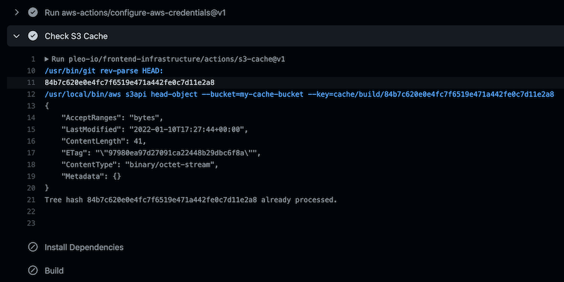

<h1 align="center">
  🔋 Pleo SPA CI/CD - S3 Cache Action
</h1>



<!-- action-docs-description -->

## Description

Allows to skip a job if it was already performed for the same repo state. Uses S3 for caching.

<!-- action-docs-description -->

It will save a `cache/some-job/{hash}` file in S3 where `hash` is the current root git repo tree
SHA-1 hash. Any time the same job is run with the same state of the repository, you can avoid any
work by checking the `processed` output which will be set to `true`. This allows to e.g. safely skip
work after merging to the main branch, if the code was tested/linted/built on a feature branch
already.

Since GitHub action do not yet support early exits from jobs, you'll need to check the value of the
`processed` output of this action for every step in the job that you want to avoid.

Note that the action assumes that the AWS credentials has already been configured for the job, and
allow to read and write to the S3 bucket provided as input. Use the `configure-aws-credentials`
action in a step prior to running this action to ensure that's the case.

<!-- action-docs-inputs -->

## Inputs

| parameter   | description                                                          | required | default           |
| ----------- | -------------------------------------------------------------------- | -------- | ----------------- |
| bucket_name | Name of the S3 bucket to use for storing cache files                 | `true`   |                   |
| key_prefix  | Key prefix to use for the cache files. By default the job ID is used | `false`  | ${{ github.job }} |

<!-- action-docs-inputs -->

<!-- action-docs-outputs -->

## Outputs

| parameter | description                                                               |
| --------- | ------------------------------------------------------------------------- |
| processed | Indicates if the job has already been performed for the current tree hash |
| hash      | The tree hash used for caching                                            |

<!-- action-docs-outputs -->

## Example Use

```yaml
- uses: aws-actions/configure-aws-credentials@v1
  with:
      aws-access-key-id: ${{ secrets.AWS_ACCESS_KEY_ID }}
      aws-secret-access-key: ${{ secrets.AWS_SECRET_ACCESS_KEY }}
- uses: 'pleo-oss/pleo-spa-cicd/actions/s3-cache@v1'
  id: s3-cache
  with:
      bucket_name: my-s3-bucket
- uses: bahmutov/npm-install@v1
  if: steps.s3-cache.outputs.processed == 'false'
```

<!-- action-docs-runs -->

## Runs

This action is an `node16` action.

<!-- action-docs-runs -->
